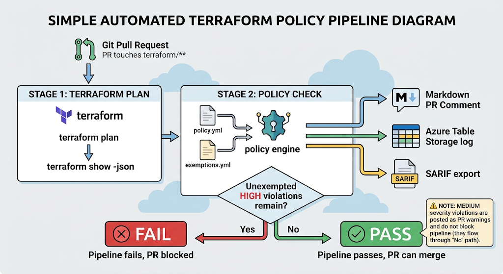

# Azure Policy Gate

A Terraform compliance engine that runs inside Azure DevOps pipelines, evaluates infrastructure changes before they are deployed, and blocks pull requests that violate organizational security and governance policy.

## Overview

Azure Policy Gate parses the output of `terraform plan` and evaluates every planned resource against a configurable set of policy rules. Violations are surfaced as an inline PR comment, logged to Azure Table Storage for a permanent audit trail, and optionally exported as SARIF for integration with code scanning tools. Pull requests containing a HIGH severity violation are blocked from merging until the underlying Terraform is fixed.

The problem this solves is a common gap in Terraform-based delivery: a pipeline can validate that code is syntactically correct and that a plan applies cleanly, but by default nothing evaluates whether the resulting infrastructure is actually compliant with security policy. Public storage access, open SSH rules, unencrypted disks, and missing governance tags all pass a normal `terraform plan` without issue. Azure Policy Gate closes that gap by treating the plan itself as a compliance checkpoint, so a violation is caught before the resource exists rather than discovered afterward during an audit.

## Architectural Diagram



The engine is intentionally decoupled: rule evaluation, configuration, exemptions, and reporting are separate modules, so any one of them can change without affecting the others.

| Component | Responsibility |
|---|---|
| `engine.py` | Loads configuration, runs every rule against every resource, applies exemptions, determines pass/fail |
| `config.py` | Loads and validates `policy.yml` |
| `exemptions.py` | Loads and validates `exemptions.yml`, confirming exempted resources actually exist in the plan |
| `rules/` | One class per policy rule, each implementing a shared `PolicyRule` interface |
| `reporter.py` | Generates the Markdown report, posts the PR comment, writes to Azure Table Storage |
| `sarif.py` | Exports results in SARIF 2.1.0 format |

## Policy Rules

| Rule ID | Checks | Default Severity |
|---|---|---|
| `PUBLIC_STORAGE` | Storage accounts with public network access, public blob access, or an open network rule | HIGH |
| `REQUIRED_TAGS` | Missing mandatory tags: `owner`, `env`, `project`, `cost-centre` | HIGH |
| `NSG_SSH_OPEN` | NSG rules exposing SSH (port 22) to `0.0.0.0/0` | HIGH |
| `DISK_ENCRYPTION` | Managed disks without encryption configured | HIGH |
| `SQL_FIREWALL_OPEN` | SQL/MSSQL firewall rules allowing unrestricted IP ranges | HIGH |
| `HTTPS_ONLY` | App Service, Function App, or Web App without `https_only = true` | HIGH |
| `NAMING_CONVENTION` | Resource names that don't follow Cloud Adoption Framework prefixes | MEDIUM |

HIGH severity violations fail the pipeline and block the PR. MEDIUM violations are posted as a warning comment but do not fail the build.

## Policy-as-Code

Rule behavior is controlled through `policy.yml` rather than hardcoded in Python. It supports enabling or disabling individual rules, overriding a rule's default severity, and customizing parameters such as the required tag list or naming prefixes. If `policy.yml` is absent, the engine falls back to its built-in defaults. A malformed configuration file fails the run immediately rather than being silently ignored.

## Exemptions

`exemptions.yml` allows a specific resource to be excluded from a specific rule without disabling that rule globally. Every exemption must include a documented reason, must reference a valid rule ID, and must correspond to a resource that actually exists in the current plan; exemptions that don't meet these conditions are rejected rather than silently accepted. An exempted violation is still logged with an `Exempted` flag and its reason, and still appears in the report, but is excluded from the pipeline's pass/fail decision. This keeps risk acceptance auditable instead of invisible.

## Reporting and Audit Trail

Every run produces a Markdown report used for the PR comment, and can optionally produce a SARIF 2.1.0 report for consumption by tools such as GitHub Advanced Security or Azure DevOps code scanning. Independently of both, every violation, exempted or not, is written to a `PolicyViolations` table in Azure Table Storage with its rule, severity, resource, message, timestamp, and exemption status, giving the project a persistent audit history that exists outside of any single pipeline run.

## Authentication

The pipeline authenticates to Azure using an Azure DevOps service connection configured with Workload Identity Federation (OIDC). No static service principal client secret is stored in pipeline variables or source control.

## Tech Stack

| Layer | Technology |
|---|---|
| CI/CD | Azure DevOps Pipelines |
| Infrastructure as Code | Terraform (AzureRM provider) |
| Policy engine | Python 3.11 |
| Remote state | Azure Blob Storage |
| Audit log | Azure Table Storage |
| Authentication | Workload Identity Federation (OIDC) |

## Testing

The project ships with 61 automated tests covering rule logic, configuration loading, exemption handling, and SARIF generation, including both true-positive and true-negative cases for every rule.

```bash
python -m pytest tests/ -v
```

## Project Status

The core compliance gate is complete: seven policy rules, configurable policy behavior, an exemption system with audit logging, Markdown and SARIF reporting, Azure Table Storage persistence, OIDC-based authentication, and an intentionally non-compliant demo environment used to validate the failure path end to end.

Planned next steps include an expiring-exemptions mechanism, richer SARIF metadata, and a compliance trend dashboard built on top of the existing Table Storage data. See `SETUP.md` for local execution, pipeline configuration, and troubleshooting.

## License

MIT. See `LICENSE` for details.
