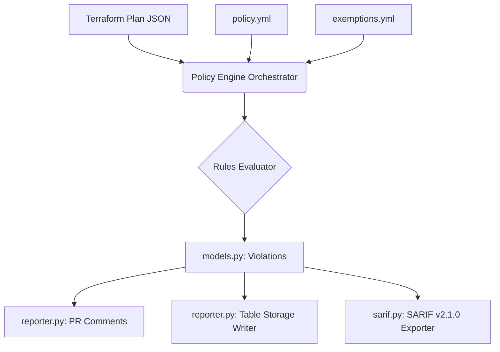

# Azure Policy Gate

Azure Policy Gate is a Terraform compliance and security engine designed to run in Azure DevOps pipelines (or locally). It parses `terraform plan` output in JSON format, evaluates it against a suite of custom rules, blocks non-compliant Pull Requests, and logs all violations to Azure Table Storage for compliance auditing.

---

## Architecture Overview

The system is designed with a decoupled, modular architecture to separate policy definition, evaluation orchestration, and violation reporting:

### Core Components

1. **CLI Entry Point (`policy_engine/main.py`)**: Parses command line arguments, handles runtime configuration exceptions, coordinates engine execution, prints results to console, and writes reports to disk.
2. **Engine Orchestrator (`policy_engine/engine.py`)**: Loads configurations, applies dynamic parameter and severity overrides to rules, parses plan JSON, executes rule evaluations, and post-processes results via the exemptions system.
3. **Data Model (`policy_engine/models.py`)**: Defines `Severity`, `Violation`, and `PolicyResult` models.
4. **Configuration Loader (`policy_engine/config.py`)**: Loads and validates the `policy.yml` policy definition file.
5. **Exemptions Loader & Validator (`policy_engine/exemptions.py`)**: Loads `exemptions.yml`, validates suppressions against strict schemas, and checks that exempted resources actually exist in the current plan.
6. **Reporter (`policy_engine/reporter.py`)**: Generates Markdown reports, handles PR comments inside Azure DevOps, and writes violation records to Azure Table Storage.
7. **SARIF Formatter (`policy_engine/sarif.py`)**: Exports structural compliance scan results to standard SARIF v2.1.0 format.

---

## Features

### 1. Policies-as-Code (`policy.yml`)
Allows administrators to adjust rules dynamically without modifying codebase rule files. Supported controls:
- **Enable/Disable rules** (`enabled: true/false`).
- **Severity overrides** (`severity: HIGH/MEDIUM/LOW`).
- **Parameter customization** (e.g., custom mandatory tags, naming conventions per resource type).

### 2. Post-Evaluation Exemptions (`exemptions.yml`)
Allows development teams to exempt specific resource instances from policy checks with documented justification:
- **No bare suppressions**: Every exemption must specify a `reason`.
- **Known Rule IDs**: Exemptions must match registered policy IDs.
- **Resource validation**: Rejects exemptions for resources that are not present in the current plan.
- **Pipeline bypass**: Exempted violations are reported but excluded from the pass/fail pipeline decision.

### 3. Integrated Reports
- **Console Logs**: Colorized compliance output.
- **PR Comments**: Inline Markdown tables posted to Azure DevOps PRs.
- **Table Storage Logging**: Immutable audit logs of all passes/failures.
- **SARIF v2.1.0 Export**: Integrated format for Azure DevOps Code Scanning/GitHub Advanced Security.

---

## Policy Rules Reference

| Rule ID | Resource Type | Target Attributes Checked | Default Severity |
|---------|---------------|---------------------------|------------------|
| `PUBLIC_STORAGE` | `azurerm_storage_account` | `public_network_access_enabled`, `allow_nested_items_to_be_public`, network rules action. | **HIGH** |
| `REQUIRED_TAGS` | All `azurerm_*` resources | Validates presence of `owner`, `env`, `project`, `cost-centre`. | **HIGH** |
| `NSG_SSH_OPEN` | `azurerm_network_security_rule` | Inbound SSH rules exposing port 22 to `0.0.0.0/0` or `*`. | **HIGH** |
| `NAMING_CONVENTION` | Checked types (RG, Storage, VNET, NSG, Disk, VM, KV, PIP, Subnet) | Enforces Cloud Adoption Framework (CAF) prefixes (e.g. `rg-`, `st-`, `vnet-`). | **MEDIUM** |
| `DISK_ENCRYPTION` | `azurerm_managed_disk` | Presence of `disk_encryption_set_id` or enabled `encryption_settings`. | **HIGH** |
| `SQL_FIREWALL_OPEN` | `azurerm_sql_firewall_rule`, `azurerm_mssql_firewall_rule` | Exposing range `0.0.0.0`->`0.0.0.0`, `0.0.0.0`->`255.255.255.255`, or using `*`. | **HIGH** |
| `HTTPS_ONLY` | App Service, Web App, Function App | Enforces `https_only = true` on host. | **HIGH** |
